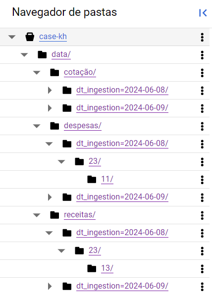
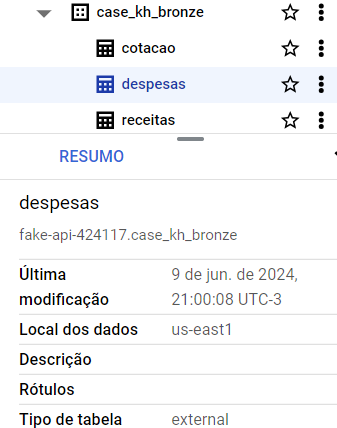
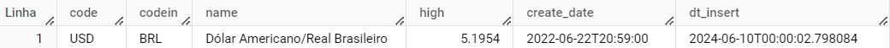
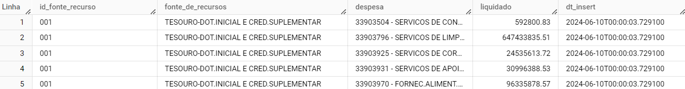
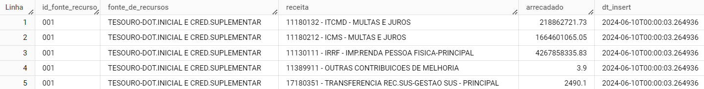
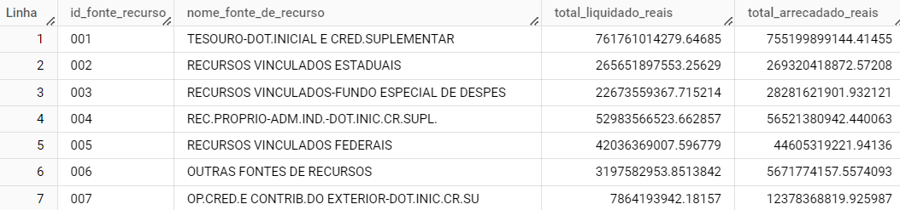

# Case Karhub

## Descrição
O desafio consiste em desenvolver um ETL para processar arquivos que representam o orçamento do Estado de São Paulo de 2022 e armazená-los em um formato consistente para responder perguntas que ajudarão nosso time.

## Índice
1. [Arquitetura do Projeto](#arquitetura-do-projeto)
2. [Tecnologias Utilizadas](#tecnologias-utilizadas)
3. [Preparação do ambiente local](#preparação-do-ambiente-local)
4. [Instalação do airflow](#instalação-do-airflow)
5. [Ingestão dos dados](#ingestão-dos-dados)
6. [Estrutura de diretórios no GCS](#estrutura-de-diretórios-no-gcs)
7. [Criação de tabelas externas no Big Query](#criação-de-tabelas-externas-no-big-query)
8. [Criação da camada de dados Silver](#criação-da-camada-de-dados-silver)
9. [Criação da tabela final](#criação-da-tabela-final)
10. [Criação das DAGs de orquestração](#criação-das-dags-de-orquestração)
11. [Perguntas finais](#perguntas-finais)

## Tecnologias Utilizadas
- Python (Pandas)
- SQL
- Apache Airflow
- Google Cloud Storage
- Big Query

## Preparação do Ambiente Local

Para ativar o ambiente virtual, utilize o comando

```sh
pipenv shell
```

## Instalação do Airflow

Instale o Docker Desktop, ele instala o Docker Compose junto por padrão.

Crie um arquivo .yml para as configurações do Airflow local com o conteúdo do arquivo 'docker-compose-exemplo.yml', armazene o arquivo no diretório do projeto. Certifique-se de substituir o campo 'YOUR_FERNET_KEY' no arquivo .yml por uma chave fernet, que pode ser gerada pelo seguinte comando:

```sh
python -c "from cryptography.fernet import Fernet; print(Fernet.generate_key().decode())"
```

Em seguida, inicie os containers com o comando:

```sh
docker-compose up -d
```

Então instale o airflow e seu componente para o google com:

```sh
pipenv install apache-airflow apache-airflow-providers-google
```

O Airflow irá criar três diretórios dentro da pasta do projeto:

- dags
- logs
- plugins

Assim como nesse repositório, todos arquivos devem ficar dentro da pasta dags, que é o local onde o airflow executa.

## Ingestão dos dados

Os dados são consumidos e armazenados por meio do módulo 'gcs_storage.py' que pode ser encontrado em 'dags/common'. O arquivo segredo json da conta de serviço deve ser colocado em 'dags/arquivo_segredo.json'.

O diretório 'dags/bronze' contém os arquivos .py que realizam as transformações necessárias dos dados para cada fonte de dados e são eles:

- dags/bronze/cotação/cotação.py
- dags/bronze/despesas/despesas.py
- dags/bronze/receitas/receitas.py

O armazenamento dos dados dentro do GCS segue o seguinte layout:

'data/despesas/dt_ingestion={data}/{hora}/{minuto}/despesas.csv'

Onde a data de ingestão é gerada a cada ciclo de execução.

## Estrutura de diretórios no GCS

A estruturação dos diretórios dentro do Data Lake fica da seguinte forma:



## Criação de tabelas externas no Big Query

A criação de tabelas externas particionadas no Big Query é feita pelos arquivos .py:

- dags/bronze/cotação/external_table.py
- dags/bronze/despesas/external_table.py
- dags/bronze/receitas/external_table.py

O particionamento das tabelas é feito pela data de ingestão dos dados seguinto o formato:

'dt_ingestion=YYYY-mm-dd'

Tabelas externas no Big Query:


## Criação da camada de dados Silver

A camada de dados Silver é responsável por consumir a camada bronze e salvar apenas os dados mais recentes baseado na data de particionamento da tabela externa 'dt_ingestion'

Os arquivos com as querys de criação das tabelas podem ser encontrados em:

- dags/silver/cotacao.py
- dags/silver/despesas.py
- dags/silver/receitas.py

Tabela silver de cotação:


Tabela silver de despesa:


Tabela silver de receita:


## Criação da tabela final

O arquivo com a query para a construção da tabela final com valores agregados, aqui considerada como camada Gold, pode ser encontrado em:

- dags/gold/valores_totais_real.py

Tabela Final:



## Criação das DAGs de orquestração

As DAGs para execução do fluxo de orquestração podem ser encontradas em:

- dags/dag_bag

OBS.: A configuração da conexão do Airflow com o provedor Google é feita a partir do console do Airflow em 'Admin > Connections', esse id é passado como o parâmetro 'gcp_conn_id' na construção da DAG.

## Perguntas finais

As querys para a contrução das respostas das perguntas são encontradas em:

- dags/perguntas_finais/perguntas_finais.sql

As respostas estão a seguir:

Quais são as 5 fontes de recursos que mais arrecadaram?

| id_fonte_recurso | nome_fonte_de_recurso | total_arrecadado_reais |
|----------|----------|----------|
| 001   | TESOURO-DOT.INICIAL E CRED.SUPLEMENTAR | 755199899144.41 |
| 002  | RECURSOS VINCULADOS ESTADUAIS | 269320418872.57 |
| 081  | TESOURO-DOT.INICIAL E CRED.SUPLEMENTAR-INTRA | 160784649176.57 |
| 004  | REC.PROPRIO-ADM.IND.-DOT.INIC.CR.SUPL. | 56521380942.44 |
| 005  | RECURSOS VINCULADOS FEDERAIS | 44605319221.94 |

Quais são as 5 fontes de recursos que mais gastaram?

| id_fonte_recurso | nome_fonte_de_recurso | total_liquidado_reais |
|----------|----------|----------|
| 001 | TESOURO-DOT.INICIAL E CRED.SUPLEMENTAR | 761761014279.65   |
| 002 | RECURSOS VINCULADOS ESTADUAIS   | 265651897553.26  |
| 081 | TESOURO-DOT.INICIAL E CRED.SUPLEMENTAR-INTRA   | 160699905642.91   |
| 004 | REC.PROPRIO-ADM.IND.-DOT.INIC.CR.SUPL. | 52983566523.66   |
| 005 | RECURSOS VINCULADOS FEDERAIS  | 42036369007.6   |

Quais são as 5 fontes de recursos com a melhor margem bruta?

| id_fonte_recurso | nome_fonte_de_recurso | margem_bruta |
|----------|----------|----------|
| 006   | OUTRAS FONTES DE RECURSOS   | 0.4362   |
| 084   | REC.PROPRIO-ADM.IND.-DOT.INIC.CR.SUPL.-INTRA   | 0.3731   |
| 007   | OP.CRED.E CONTRIB.DO EXTERIOR-DOT.INIC.CR.SU  | 0.3647   |
| 003   | RECURSOS VINCULADOS-FUNDO ESPECIAL DE DESPES   | 0.1983   |
| 004   |REC.PROPRIO-ADM.IND.-DOT.INIC.CR.SUPL.  | 0.0626   |

Quais são as 5 fontes de recursos que menos arrecadaram?

| id_fonte_recurso | nome_fonte_de_recurso | total_arrecadado_reais |
|----------|----------|----------|
| 043   | F.E.D - CREDITO POR SUPERAVIT FINANCEIRO  | 0.0   |
| 041   | TESOURO - CREDITO POR SUPERAVIT FINANCEIRO  | 0.05   |
| 045   | REC.VINC.TRANSF.FEDERAL/SUPERAVIT FINANC.   | 678.68   |
| 042   | REC.VINC.ESTADUAIS-CRED.SUPERAVIT FINANCEIRO   | 27816.59   |
| 044   | REC.PROP.ADM.IND-CRED.P/SUPERVAVIT FINANCEIR   | 2991847.98   |

Quais são as 5 fontes de recursos que menos gastaram?

| id_fonte_recurso | nome_fonte_de_recurso | total_liquidado_reais |
|----------|----------|----------|
| 084   | REC.PROPRIO-ADM.IND.-DOT.INIC.CR.SUPL.-INTRA   | 14253027.37   |
| 043   | F.E.D - CREDITO POR SUPERAVIT FINANCEIRO   | 161784292.1   |
| 087   | OP.CRED.CONTR.EXTERIOR-DOT.INIC.CR.SUP-INTRA   | 241282334.47   |
| 083   | RECURSOS VINCULADOS-FUNDO ESP. DESPESA-INTRA   | 244163474.71   |
| 086   | OUTRAS FONTES DE RECURSOS-INTRA  | 713729134.86   |

Quais são as 5 fontes de recursos com a pior margem bruta?

| id_fonte_recurso | nome_fonte_de_recurso | total_liquidado_reais |
|----------|----------|----------|
| 043   | F.E.D - CREDITO POR SUPERAVIT FINANCEIRO   | null   |
| 041   | TESOURO - CREDITO POR SUPERAVIT FINANCEIRO   | -141732840456.0   |
| 045   | REC.VINC.TRANSF.FEDERAL/SUPERAVIT FINANC.   | -2496959.9505  |
| 042   | REC.VINC.ESTADUAIS-CRED.SUPERAVIT FINANCEIRO   | -97942.2262   |
| 044   | REC.PROP.ADM.IND-CRED.P/SUPERVAVIT FINANCEIR   | -818.7584   |

Qual a média de arrecadação por fonte de recurso?

| id_fonte_recurso | nome_fonte_de_recurso | media_arrecadacao |
|----------|----------|----------|
| 001   |  TESOURO-DOT.INICIAL E CRED.SUPLEMENTAR  |  2595702445.3789291  |
| 002   |  RECURSOS VINCULADOS ESTADUAIS  | 1401033652.8081079  |
| 003   |  RECURSOS VINCULADOS-FUNDO ESPECIAL DE DESPES  |  139579203.21 |
| 004   | REC.PROPRIO-ADM.IND.-DOT.INIC.CR.SUPL.  |  194270003.07428569  |
| 005   |  RECURSOS VINCULADOS FEDERAIS  | 317982996.51074076   |
| 006   |  OUTRAS FONTES DE RECURSOS  |  218338305.32999995  |
| 007   |  OP.CRED.E CONTRIB.DO EXTERIOR-DOT.INIC.CR.SU  |  238256319.43499994 |
| 041   |  TESOURO - CREDITO POR SUPERAVIT FINANCEIRO  | 0.0033333333333333331  |
| 042   |  REC.VINC.ESTADUAIS-CRED.SUPERAVIT FINANCEIRO  |  1338.52 |
| 043   | F.E.D - CREDITO POR SUPERAVIT FINANCEIRO  |  0.0  |
| 044   |  REC.PROP.ADM.IND-CRED.P/SUPERVAVIT FINANCEIR  |  115172.95999999999  |
| 045   |  REC.VINC.TRANSF.FEDERAL/SUPERAVIT FINANC.  |  32.6575  |
| 047   |  REC.OPERAC. DE CREDITO-P/SUPERAVIT FINANCEIR  | 11905316.795000002  |
| 081   |  TESOURO-DOT.INICIAL E CRED.SUPLEMENTAR-INTRA  |  1719305637.6427777 |
| 082   |  RECURSOS VINCULADOS ESTADUAIS-INTRA |  203085143.76  |
| 083   |  RECURSOS VINCULADOS-FUNDO ESP. DESPESA-INTRA  |  15914329.676666668  |
| 084   |  REC.PROPRIO-ADM.IND.-DOT.INIC.CR.SUPL.-INTRA  |  1458765.0366666666  |
| 085   |  RECURSOS VINCULADOS FEDERAIS-INTRA   | 56451110.2225  |
| 086   |  OUTRAS FONTES DE RECURSOS-INTRA  | 137377128.78  |
| 087   |  OP.CRED.CONTR.EXTERIOR-DOT.INIC.CR.SUP-INTRA |  46441531.83  |
| 099   |  EXTRA ORCAMENTARIA  |  0.0  |

Qual a média de gastos por fonte de recurso?

| id_fonte_recurso | nome_fonte_de_recurso | media_liquidado |
|----------|----------|----------|
| 001   |  TESOURO-DOT.INICIAL E CRED.SUPLEMENTAR  | 363826816.39238197   |
| 002   |  RECURSOS VINCULADOS ESTADUAIS  |  290523498.00835228 |
| 003   |  RECURSOS VINCULADOS-FUNDO ESPECIAL DE DESPES  |  20489016.346995313 |
| 004   | REC.PROPRIO-ADM.IND.-DOT.INIC.CR.SUPL.  |  38338980.697255619  |
| 005   |  RECURSOS VINCULADOS FEDERAIS  |  39468656.614243872  |
| 006   |  OUTRAS FONTES DE RECURSOS  |  21222905.102068964  |
| 007   |  OP.CRED.E CONTRIB.DO EXTERIOR-DOT.INIC.CR.SU  | 44520118.1485294  |
| 041   |  TESOURO - CREDITO POR SUPERAVIT FINANCEIRO  | 32961125.687674426  |
| 042   |  REC.VINC.ESTADUAIS-CRED.SUPERAVIT FINANCEIRO |  10924913.930416673  |
| 043   |  F.E.D - CREDITO POR SUPERAVIT FINANCEIRO  |  389248.88387500012  |
| 044   |  REC.PROP.ADM.IND-CRED.P/SUPERVAVIT FINANCEIR  |  3496815.034444443  |
| 045   |  REC.VINC.TRANSF.FEDERAL/SUPERAVIT FINANC.  | 3584373.7248351648  |
| 047   |  REC.OPERAC. DE CREDITO-P/SUPERAVIT FINANCEIR  | 27905070.531562511  |
| 081   |  TESOURO-DOT.INICIAL E CRED.SUPLEMENTAR-INTRA |  176749658.37131435  |
| 082   |  RECURSOS VINCULADOS ESTADUAIS-INTRA  |  135390095.83999997  |
| 083   |   RECURSOS VINCULADOS-FUNDO ESP. DESPESA-INTRA | 1305446.8841666668   |
| 084   |   REC.PROPRIO-ADM.IND.-DOT.INIC.CR.SUPL.-INTRA | 105515.1403846154  |
| 085   |  RECURSOS VINCULADOS FEDERAIS-INTRA  | 7526814.6963333357  |
| 086   |  OUTRAS FONTES DE RECURSOS-INTRA |  45792376.26  |
| 087   |  OP.CRED.CONTR.EXTERIOR-DOT.INIC.CR.SUP-INTRA  |  7740255.305  |